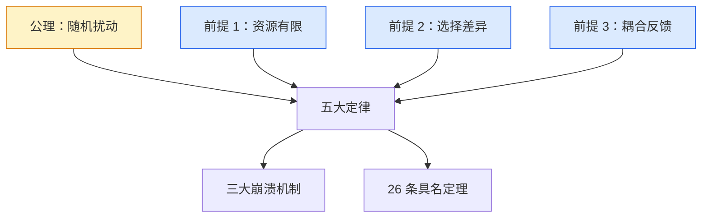

# 第一部分：理论篇——秩序的真相

> 从"随机扰动公理"出发，严格推导演化的基本逻辑与运行定律，建立一个解释秩序如何生成、如何维持、又如何崩解的系统化框架。

---

## 序言

引言里我们呈现了一个直觉性的轮廓：一条公理 + 三条经验前提 → 五大定律 → 三大崩溃机制 → 26 条具名推论。本部分要做的，是把这个轮廓中的每一个节点逐一展开——把概念阐明、把推导补全、把案例落地。

理论篇共分七节，**§1 阐明全部前提，§2 才正式开始推导**：

- **§1** 公理与三条经验前提
- **§2** 五大定律的逐条推导
- **§3** 三大崩溃机制——三条定律的失效路径
- **§4–§7** 26 条具名定理的分组推导

我们从最根本的那颗种子开始。

---

## §1 公理与三条经验前提

### 1.1 重新审视公理

引言里给出的公理是一句简短的断言：

> [!IMPORTANT]
> ### 随机扰动公理
>
> **一切开放系统始终处于内外部的持续随机扰动之中。**

这句话看似简单，却需要被严肃对待——它是本书全部推导的唯一根基。

#### 为什么是"公理"，而不是"定理"？

公理在数学传统中指的是**不被证明、只被接受**的初始命题。本书的"公理"并非纯数学公理——它有强烈的经验内容。我们之所以仍称它为公理，是因为它具有三个特征：

第一，**它在一切已知的开放系统中都成立**。从亚原子粒子的量子涨落到星系尺度的引力扰动，从单细胞内部的分子布朗运动到全球经济的政策冲击——找不到一个开放系统能逃脱"持续扰动"。

第二，**它无法从更基本的命题中推出**。我们可以问"为什么会有扰动？"，得到的回答总是更深一层的扰动机制（量子不确定性、热涨落、信息不完备、计算不可解），而这些机制本身仍然是扰动的不同表现。再追问下去，要么回到同义反复，要么滑向形而上学。

第三，**它在经验上可证伪**。如果有人能找到一个开放系统，在足够长时间内严格不受任何内外部扰动——本书的整个理论将被推翻。

所以这是一条**经验公理**：基础到不能再基础，但仍然有"一旦发现反例就崩塌"的科学品质。

#### "随机"指什么？

引言中的脚注已经点明：本书所言"随机"兼具**本体论**与**认识论**双重含义。这里展开一点：

- **本体论随机**：在最深的物理层面，量子力学已证明真随机的存在——一个放射性原子何时衰变，没有任何信息能让你提前预测，连原则上都不能。
- **认识论随机**：即使在经典物理层面，复杂系统对初始条件的极端敏感性（混沌）、信息传递的有损性、状态空间的指数级膨胀，都让"原则上可预测"在实践中等同于"不可预测"。

这两类随机的关键共同点是：**对系统状态轨迹的影响在数学上等价**。无论扰动来自量子真随机，还是来自蝴蝶翅膀引发的混沌——一旦它进入系统，其传播规律完全相同。这也是本书无需在二者之间做形而上选择的原因。

---

### 1.2 为什么仅有公理还不够？

公理告诉我们：**扰动无处不在**。但仅凭这一条，推不出任何具体的演化规律。

考虑一个反事实：一片完全均匀的能量场，没有任何结构、没有任何区分。在它之上施加扰动，得到的只是更复杂的均匀场——什么也不会"演化"出来。

要让"扰动"转化为"演化"，至少需要三个额外条件：

1. **有限性**——扰动产生的状态不能任意扩张，必须在某个有限空间里彼此竞争位置
2. **差异性**——不同的扰动后状态必须有不同的存留概率，不能等概率保留
3. **互动性**——状态之间必须能彼此影响，不能各自孤立

这三个条件，就是本书的**三条经验前提**。它们与公理不同：

| 类别 | 性质 | 一旦不成立 |
|:---|:---|:---|
| **公理** | "找不到反例则成立"的硬骨头 | 整个理论崩塌 |
| **经验前提** | "在我们这个宇宙中跨学科普遍成立"的软规律 | 部分定律失效，理论需重新校准 |

可以这样区分二者的角色：

> *公理负责**扰动**——演化的"动力源"；前提负责**选择**与**互动**——演化的"加工厂"。二者结合，才长出五大定律。*

---

### 1.3 三条经验前提详解

#### 前提一 · 资源有限性

> **任何系统能调用的物质、能量、空间均存在上限。**

**跨学科例证**：

- **物理**：宇宙的总能量守恒；任一空间区域所能容纳的信息量受 Bekenstein 熵上限约束（与区域表面积成正比）
- **生物**：生态位的承载量（K 值）；任一生物体的代谢率受体型与温度约束
- **经济**：地球资源的物理总量；市场规模受人口与购买力约束
- **社会**：注意力、时间、信任等"软资源"同样稀缺——24 小时是任何人最硬的预算

**反事实想象**：如果资源真的无限，"选择"就失去意义——任何变体都能无代价存活下去，结构永远不会形成。**演化与稀缺，是同一枚硬币的两面**：没有稀缺就没有竞争，没有竞争就没有结构。

**支撑的定律**：定律 II（适应性选择）、定律 IV（脆弱性积累）

---

#### 前提二 · 选择差异性

> **在有限资源下，系统状态之间存在差异化的存留概率。**

注意这里的精微：选择差异性**不要求存在"目的性"或"评判者"**。它只要求一件事——**不同状态在同样条件下，存留下去的可能性不同**。

**跨学科例证**：

- **化学**：自催化反应中，某些分子构型比其他更稳定，因而更可能在反应混合物中累积
- **生物**：携带某基因的个体，繁殖到下一代的期望子代数与不携带者不同
- **市场**：两个产品在同样营销投入下，留存的用户数不同
- **思想**：两个观点在同样传播渠道下，被复述的频率不同

**反事实想象**：如果一切状态等概率存留，那么"选择"消失，演化退化为纯粹的随机扩散——系统会缓慢均匀化，永远不会形成结构。这正是为什么一杯热咖啡放久了变凉而不是反向变热——温度均匀化是熵最大化方向，是一切选择差异消失后的极限状态。

**支撑的定律**：定律 II（适应性选择）、定律 III（反馈累积）

---

#### 前提三 · 耦合反馈性

> **系统状态之间通过物理或信息通道互相影响。**

耦合反馈性是最容易被忽视、却最关键的一条前提。它说的是：**状态不是孤立的——一个状态被选择保留后，会改变下一轮选择的条件**。

**跨学科例证**：

- **物理**：恒星形成过程中，原始气体云的局部密度涨落通过引力反馈不断放大，引力又改变了下一轮密度涨落的边界条件
- **生物**：捕食者—猎物动力学，一方数量改变会立即影响另一方的存留概率
- **经济**：成功的商业模式吸引模仿者，模仿者的进入又改变原模式的盈利空间
- **文化**：某种观点占据多数后，少数派表达的成本上升（沉默螺旋[^沉默螺旋]）

[^沉默螺旋]: 由德国传播学家 Elisabeth Noelle-Neumann 在 1970 年代提出的理论：人在判断自己的观点是否说出口前，会评估它在群体中的"声势"——感到自己处于少数派时倾向于沉默，从而进一步加剧多数派的优势。这是耦合反馈性在认知传播中最干净的例子。

**反事实想象**：*如果状态完全独立呢？* 演化退化为一系列独立采样——没有积累、没有方向、没有今天我们所见的复杂结构。

**支撑的定律**：定律 III（反馈累积）、定律 IV（脆弱性积累）、定律 V（重组循环）

---

### 1.4 研究对象的边界：什么是、什么不是"演化型系统"？

引言中给出过定义：

> **演化型系统**：一类开放性系统——它们与外界持续交换物质、能量与信息，因而不断暴露于随机扰动之中；其内部结构由复制、变异、选择三类机制驱动而成形。

#### 定义中三机制 与 三条经验前提：什么关系？

读到这里，细心的读者会问：定义里的"复制、变异、选择"三类机制，跟前面那三条"经验前提"——是同一回事吗？

**不是同一回事，但二者紧密相关**。要厘清它们的层级，可以这样理解：

- **公理 + 三条经验前提**——是**前置条件**，逻辑上更基础
- **复制 / 变异 / 选择**——是这种系统在长期运行后**外显的可观察机制**，是判断"是否演化型"的**操作性标志**

具体的对应关系：

| 外显机制 | 由什么前置条件涌现而来 |
|:---|:---|
| **变异** | 公理（随机扰动施加于既有状态） |
| **选择** | 前提一（资源有限）+ 前提二（差异化存留）共同作用 |
| **复制** | 前提三（耦合反馈）——状态之所以能"延续"到下一轮，正是因为它能影响后续条件 |

因此，更精确的等价表述是：

> ### 演化型系统（精确版）
>
> **演化型系统 = 满足公理与三条经验前提的开放系统。**
>
> 引言中所说的"复制 / 变异 / 选择"是这种系统在长期运行后必然涌现的可观察机制，不是逻辑定义本身——但它们是判断"某个具体系统是否演化型"最直观的操作性标志。

#### 边界核查表

在精确定义下，更精确地划定本书研究对象的边界：

| 系统类型 | 公理 | 前提 1 | 前提 2 | 前提 3 | 是否演化型 |
|:---|:---:|:---:|:---:|:---:|:---:|
| 宇宙星系、恒星形成 | ✓ | ✓ | ✓ | ✓ | ✅ |
| 物种族群、生态网络 | ✓ | ✓ | ✓ | ✓ | ✅ |
| 人类社会、政治制度 | ✓ | ✓ | ✓ | ✓ | ✅ |
| 经济市场、产业生态 | ✓ | ✓ | ✓ | ✓ | ✅ |
| 技术体系、知识生产 | ✓ | ✓ | ✓ | ✓ | ✅ |
| 纯数学结构（如群、环、域） | — | — | — | — | ❌ |
| 完全孤立的封闭系统 | ✗ | — | — | — | ❌ |
| 单个量子粒子 | ✓ | ✓ | ✓ | 弱 | ⚠️ 演化语言不太适用 |
| 确定性算法 | ✗ | — | — | — | ❌ |

**为什么明确边界很重要？**

> *理论的解释力来自其限定性。一个声称"解释一切"的理论往往什么都解释不了。*

本书只声称解释**符合公理 + 三前提**的演化型系统——这已经覆盖了人类关心的绝大多数复杂结构。对纯数学、纯逻辑、严格封闭系统这些"非演化"对象，本书的定律并不强行适用。这不是理论的弱点，而是**学科自觉**。

---

### 1.5 通往五大定律

公理与三条经验前提共同构成本书的**初始假设集**。在它们的支撑下，下一节将看到五大定律如何被逐条推出：

**推导路径预览**：

| 定律 | 所需前置条件 |
|:---|:---|
| **定律 I** 多样性生成 | 仅需公理（扰动作用于既有状态产生变异） |
| **定律 II** 适应性选择 | 公理 + 前提一（资源有限）+ 前提二（选择差异） |
| **定律 III** 反馈累积 | 公理 + 三前提全部 |
| **定律 IV** 脆弱性积累 | 公理 + 三前提全部 + 时间累积 |
| **定律 V** 重组循环 | 公理 + 三前提全部 + 临界点条件 |

注意每条定律不是从同一组前提"一锅端"地推出，而是逐步加入新条件——这一点对理解 §3「为什么三大崩溃机制只对应定律 II / III / IV」尤其重要。

各定律的严格推导见 §2。

---

> [!NOTE]
> **§1 小结**
>
> - **公理**：随机扰动无处不在——经验公理，可证伪
> - **前提一**：资源有限——扰动后的状态需要在有限空间竞争
> - **前提二**：选择差异——不同状态有不同的存留概率
> - **前提三**：耦合反馈——状态之间互相影响
> - **研究对象**：同时满足公理与三前提的开放系统
> - **下一步**：从这四条初始假设推导五大定律

---

## §2-§7（待撰写）

- §2 五大定律的逐条推导
- §3 三大崩溃机制——三条定律的失效路径
- §4 推论一组：演化约束与方向性（定理 1-5）
- §5 推论二组：不确定性与预测（定理 6-13）
- §6 推论三组：适应与生存策略（定理 14-19）
- §7 推论四组：观察与认知偏差（定理 20-26）

---

> **上一章** ← [引言：一切系统终将崩溃？](./引言初稿.md)
> **下一章** → [第二部分 · 第一章：宇宙](./第二部分_应用篇/01_宇宙.md)
